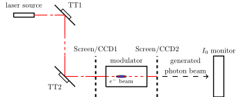
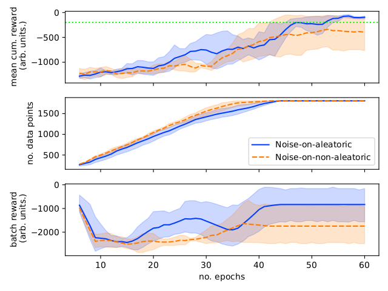
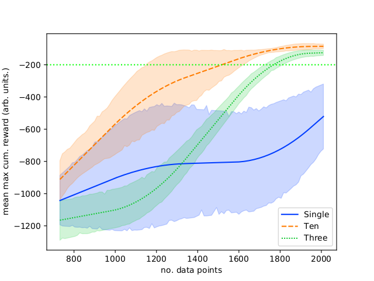
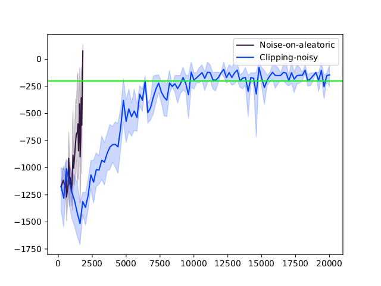
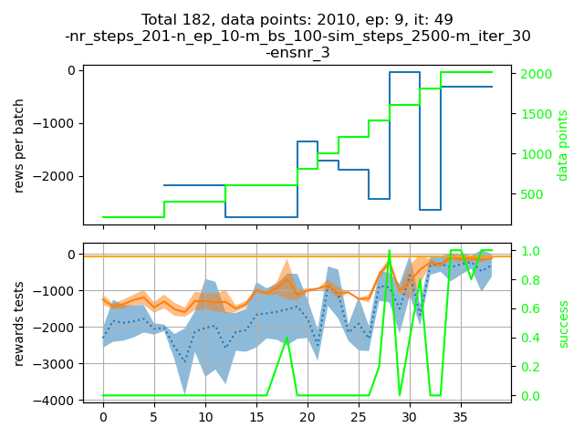

# Model-free and Bayesian Ensembling Model-based Deep Reinforcement Learning for Particle Accelerator Control Demonstrated on the FERMI FEL

Contact: simon.hirlaender(at)sbg.ac.at

Pre-print
[https://arxiv.org/abs/2012.09737](https://arxiv.org/abs/2012.09737)

Please cite code as:

## The included scripts:
1. To run the NAF2 as used in the paper on the pendulum run: run_naf2.py
2. To run the AE-DYNA as used in the paper on the pendulum run: AEDYNA.py

The rest should be straight forward, otherwise contact me.

## These are the results of RL tests @FERMI-FEL
The problem has four degrees of freedom in state and action space.
A schematic overview:

Algorithm | Type | Representational power|Noise resistive|Sample efficiency
------------ | -------------|---------|------------|---------
_NAF_ | Model-free|Low|No|High
_NAF2_ | Model-free|Low|Yes|High
_ME-TRPO_ | Model-based|High|No|High
_AE-DYNA_ | Model-based|High|Yes|High

## Experiments done on the machine:

A new implementation of the NAF with double Q learning (single network dashed, double network solid):

A new implementation of a _AE-DYNA_:

A variant of the _ME-TRPO_:

## The evolution as presented at GSI [Towards Artificial Intelligence in Accelerator Operation](https://indico.gsi.de/event/11539/):

## Experiments done on the [_inverted pendulum_](https://gym.openai.com/envs/Pendulum-v0/) openai gym environment:

Cumulative reward of different _NAF_ implementations on the _inverted pendulum_ with artificial noise.

Comparison of the inclusion of aleatoric noise in the AE-DYNA in the noisy _inverted pendulum_:

Comparison of the inclusion of aleatoric noise in the AE-DYNA in the noisy _inverted pendulum_:

Sample efficiency of _NAF_ and _AE-DYNA_:

Free run on the _inverted pendulum_:

