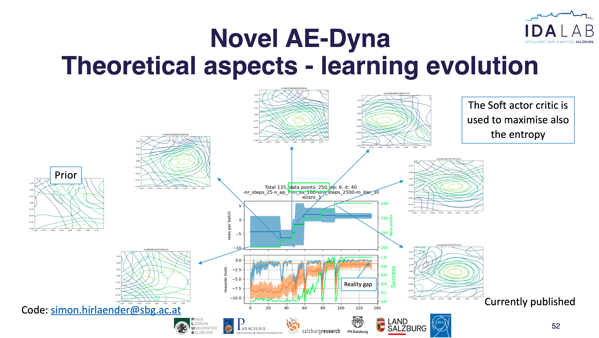

# Model-free and Bayesian Ensembling Model-based Deep Reinforcement Learning for Particle Accelerator Control Demonstrated on the FERMI FEL

**Pre-print:** [arXiv:2012.09737](https://arxiv.org/abs/2012.09737)

**Contact:** simon.hirlaender(at)sbg.ac.at

**Cite as:**
[](https://doi.org/10.5281/zenodo.4348989)

---

## Abstract

Reinforcement learning holds significant potential in accelerator controls. The primary goal of this paper is to demonstrate the operational application of this approach to accelerator physics problems. Despite the success of model-free reinforcement learning in several domains, sample efficiency remains a limiting factor, a challenge that model-based methods may mitigate.
We compare well-suited purely model-based to model-free reinforcement learning applied to the intensity optimisation on the FERMI FEL system. We find that the model-based approach demonstrates higher representational power and sample-efficiency, while the asymptotic performance of the model-free method is slightly superior. The model-based algorithm is implemented in a DYNA-style using an uncertainty aware model, and the model-free algorithm is based on tailored deep Q-learning. In both cases, the algorithms were implemented in a manner that presents increased noise robustness as prevalent in accelerator control problems.

## Schematic Overview


## Algorithms & Code

This repository contains implementations of both Model-Free and Model-Based RL algorithms applied to the FERMI FEL control problem and simulated environments (Inverted Pendulum).

| Algorithm   | Type        | Representational power | Noise resistive | Sample efficiency |
| ----------- | ----------- | ---------------------- | --------------- | ----------------- |
| _NAF_       | Model-free  | Low                    | No              | High              |
| _NAF2_      | Model-free  | Low                    | Yes             | High              |
| _ME-TRPO_   | Model-based | High                   | No              | High              |
| _AE-DYNA_   | Model-based | High                   | Yes             | High              |

### Scripts

> [!IMPORTANT]
> The repository contains scripts using different TensorFlow versions. Please check the requirements below.

1. **`run_naf2.py`** (TensorFlow 2.x): Runs the Normalized Advantage Function (NAF2) with double Q-learning on the inverted pendulum environment.
2. **`AE_Dyna_Tensorflow_2.py`** (TensorFlow 2.x): Runs the Uncertainty Aware DYNA-style RL (AE-DYNA) on the inverted pendulum environment using TensorFlow 2.
3. **`AEDYNA.py`**

### TensorFlow 1.15 (Legacy)

Required **only** for `src/AEDYNA.py` (original paper implementation). Requires stable-baselines (v2) and TensorFlow 1.x.

## Installation

### Prerequisites

### TensorFlow 2 (Recommended)

This environment supports `run_naf2.py` and `AE_Dyna_Tensorflow_2.py`.

```bash
# Creative a virtual environment (optional but recommended)
conda create -n fermi_rl python=3.8
conda activate fermi_rl

# Install dependencies
pip install -r requirements.txt
```

### Legacy Setup (`AEDYNA.py`)

To run the legacy script `AEDYNA.py`, you must use an environment compatible with TensorFlow 1.15 and `stable-baselines` (v2). This is separate from the main TF2 environment.

## Usage

### Running the Experiments

Run scripts from the `src/` directory or adjust paths accordingly.

1. **NAF2 (TensorFlow 2)**:

    ```bash
    python src/run_naf2.py
    ```

2. **AE-DYNA (TensorFlow 2)**:

    ```bash
    python src/AE_Dyna_Tensorflow_2.py
    ```

3. **AE-DYNA (Legacy TF 1.15)**:

    ```bash
    # Activate 'fermi_legacy' environment first
    python src/AEDYNA.py
    ```

## Results

### FERMI FEL Optimisation

Comparing NAF2 (Model-Free) and AE-DYNA (Model-Based) performance.

#### Experimental Results at FERMI FEL


#### AE-DYNA Training


### Inverted Pendulum Benchmarks

**Noise Robustness:**


**Sample Efficiency (NAF vs AE-DYNA):**


### Learning Evolution

The evolution as presented at GSI [Towards Artificial Intelligence in Accelerator Operation](https://indico.gsi.de/event/11539/):


### TensorFlow 2 Implementation

The repository includes an updated implementation of AE-DYNA using TensorFlow 2 (`AE_Dyna_Tensorflow_2.py`), based on `tensorlayer`.

1. To run the updated AE-DYNA with TensorFlow 2: `src/AE_Dyna_Tensorflow_2.py`
2. Legacy AE-DYNA (TF 1.15): `src/AEDYNA.py` (requires separate environment)


