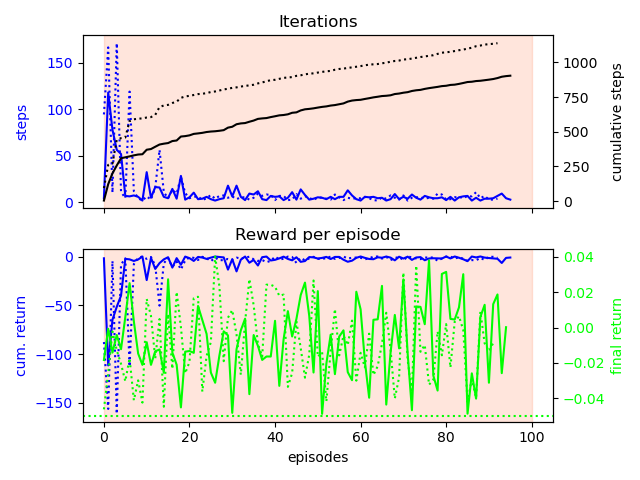
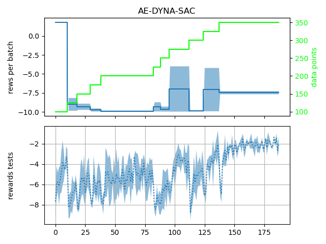
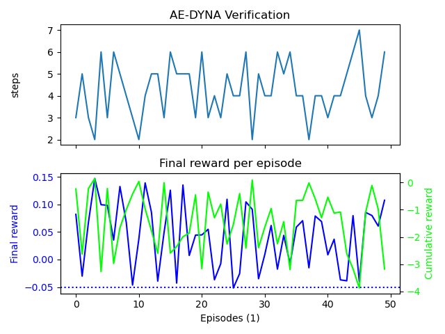
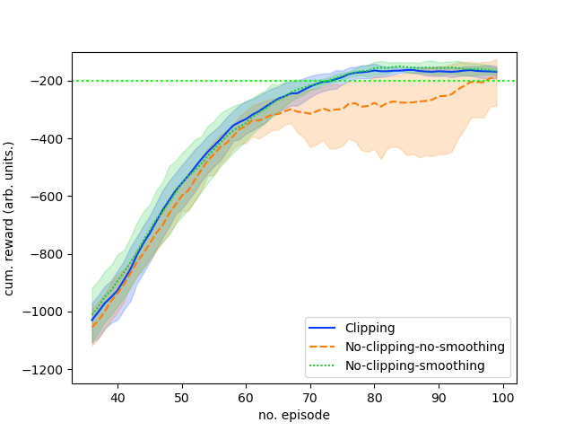

# Model-free and Bayesian Ensembling Model-based Deep Reinforcement Learning for Particle Accelerator Control

[](https://arxiv.org/abs/2012.09737)
[](https://doi.org/10.5281/zenodo.4348989)

**Contact:** simon.hirlaender(at)sbg.ac.at

This repository accompanies the paper demonstrating deep reinforcement learning for the intensity optimisation of the **FERMI Free-Electron Laser (FEL)**. We compare model-free (NAF2) and model-based (AE-DYNA) approaches, finding that model-based methods offer superior sample efficiency and representational power, while model-free methods achieve slightly better asymptotic performance.


---

## Algorithms

| Algorithm | Type        | Noise Robust | Sample Efficient |
| --------- | ----------- | :----------: | :--------------: |
| NAF       | Model-free  |      ✗       |        ✓         |
| **NAF2**  | Model-free  |      ✓       |        ✓         |
| ME-TRPO   | Model-based |      ✗       |        ✓         |
| **AE-DYNA** | Model-based |      ✓       |        ✓         |

---

## Quick Start

### Installation (TensorFlow 2)

```bash
conda create -n fermi_rl python=3.8
conda activate fermi_rl
pip install -r requirements.txt
```

### Running Experiments

```bash
# NAF2 (Model-Free)
python src/run_naf2.py

# AE-DYNA (Model-Based)
python src/AE_Dyna_Tensorflow_2.py
```

> [!NOTE]
> The legacy script `src/AEDYNA.py` requires TensorFlow 1.15 and `stable-baselines` (v2) in a separate environment.

---

## Results

### FERMI FEL Performance

| | NAF2 Training | NAF2 Convergence |
|---|---|---|
|  |  |

| | AE-DYNA Training | AE-DYNA Verification |
|---|---|---|
|  |  |

### Inverted Pendulum Benchmarks

| Noise Robustness | Sample Efficiency (NAF vs AE-DYNA) |
|---|---|
|  |  |

---

## Project Structure

```
.
├── src/                  # Python source code
│   ├── run_naf2.py       # NAF2 agent (TF2)
│   ├── AE_Dyna_Tensorflow_2.py # AE-DYNA agent (TF2)
│   └── AEDYNA.py         # AE-DYNA agent (TF1.15 legacy)
├── paper/                # LaTeX source and figures
│   ├── main.tex
│   └── Figures/
├── data/                 # Experimental data
└── requirements.txt
```

---

## Citation

If you use this work, please cite:

```bibtex
@software{hirlaender_fermi_rl,
  author       = {Hirlaender, Simon and Bruchon, Niky},
  title        = {FERMI RL Paper Code},
  year         = 2020,
  publisher    = {Zenodo},
  doi          = {10.5281/zenodo.4348989},
  url          = {https://doi.org/10.5281/zenodo.4348989}
}
```
