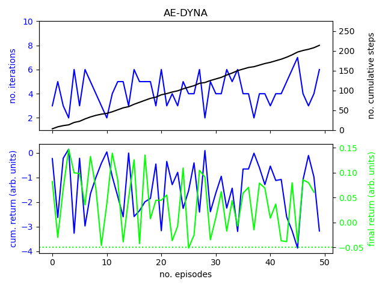

# Online Model-Based and Model-Free Reinforcement Learning in Accelerator Operation with Applications to FERMI FEL

##These are the results of RL tests @FERMI-FEL
The problem has four degrees of freedom in state and action space.
A schematic overview:

A new implementation of the NAF with doule Q learning:

A new implementation of a AE-dyna:

A variant of the ME-TRPO:

The evolution as presented at GSI [Towards Artificial Intelligence in Accelerator Operation](https://indico.gsi.de/event/11539/):
