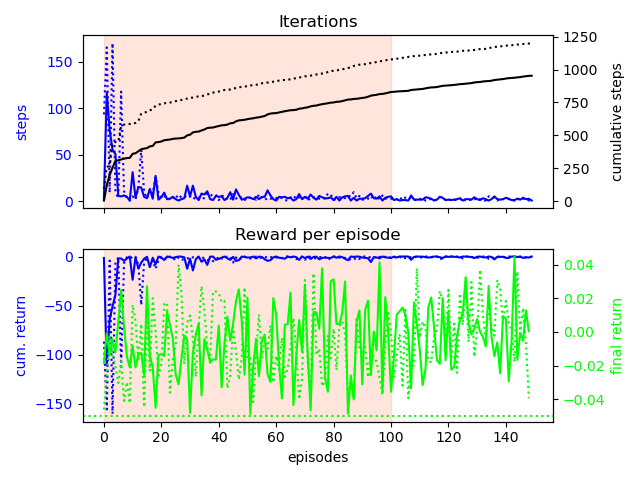
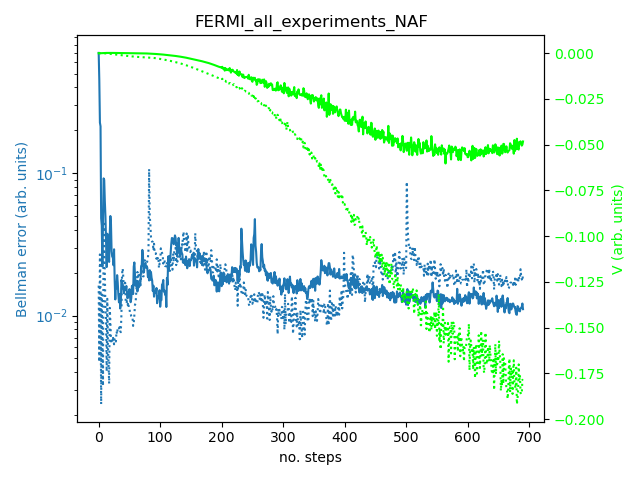
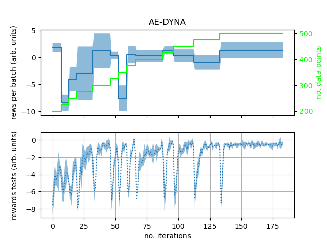
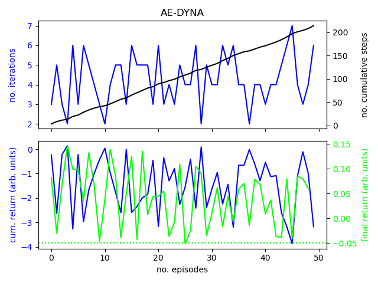
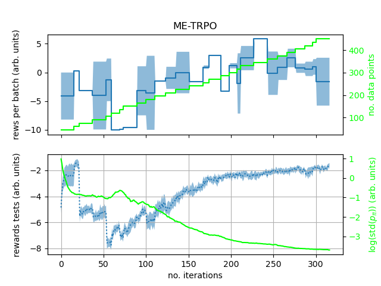
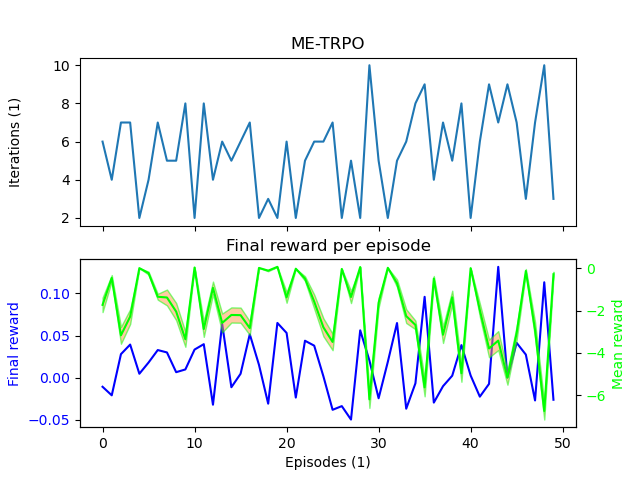
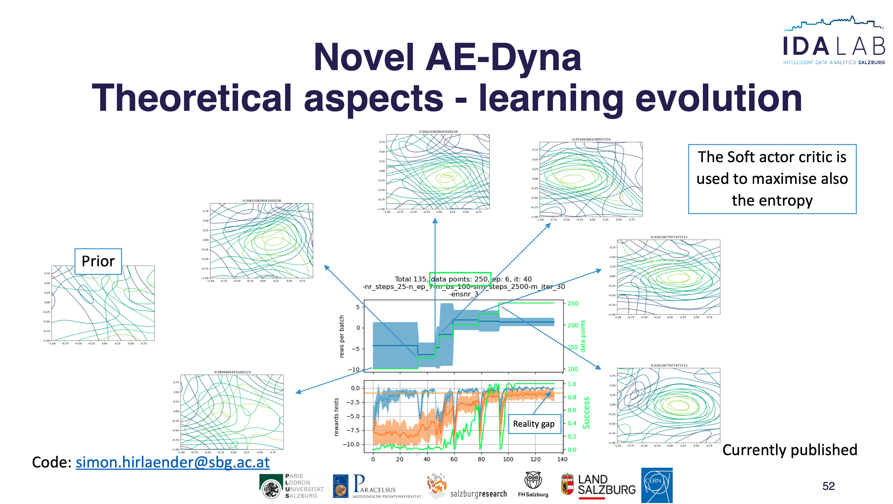

# FermiPaper

These are the results of RL tests @FERMI-FEL
A new implementation of the NAF with doule Q learning:

A new implementation of a AE-dyna:

A variant of the ME-TRPO:

The evolution:
